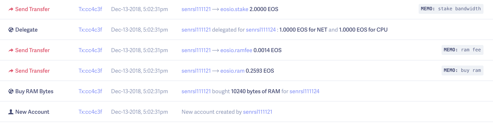
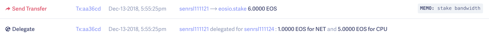
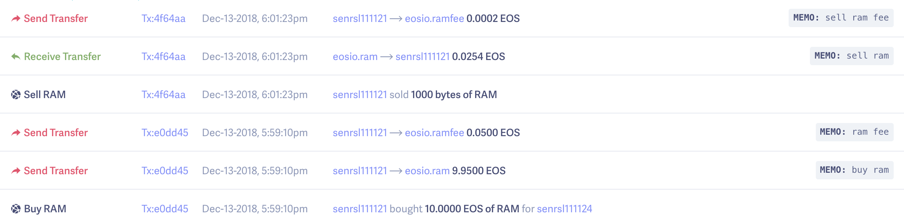

# TEST

虽然不知道这都是些什么，但我觉得可以开始抓接口了。。。。

[TOC]

## 接口

只是账户相关，参考之前那个 [README](https://github.com/senRsl/PocketEOS-Android/blob/master/README.md)

其中base domain 为 http://api.kylin.eosbeijing.one:8880

### 连接服务器

POST /v1/chain/get_info

REQ: 无

RESP:
```json
{
	"server_version": "ea08cfd3",
	"chain_id": "5fff1dae8dc8e2fc4d5b23b2c7665c97f9e9d8edf2b6485a86ba311c25639191",
	"head_block_num": 25071389,
	"last_irreversible_block_num": 25071061,
	"last_irreversible_block_id": "017e8dd544e7768bede88625f78fe2a67740e7b720d03f0cef0352ac12a0e7f2",
	"head_block_id": "017e8f1d749b45d0298a5f7f5f36d970547a2e694960327fb4abd21ac298c314",
	"head_block_time": "2018-12-12T04:31:31.500",
	"head_block_producer": "eosargentina",
	"virtual_block_cpu_limit": 250000000,
	"virtual_block_net_limit": 1048576000,
	"block_cpu_limit": 249398,
	"block_net_limit": 1048392,
	"server_version_string": "v1.5.0"
}
```

### 创建钱包

本地生成存储，不走网络

### 创建账户

创建个账户走那么多接口  

1. POST  /v1/chain/abi_json_to_bin  
```json
{
	"action": "buyram",
	"args": {
		"payer": "senrsl111121",      //谁帮你创建的时候付钱
		"receiver": "senrsl111131",   //创建新账户收到钱
		"quant": "10.0000 EOS"
	},
	"code": "eosio"
}
```

RESP:
```json
{
	"binargs": "10440821447ca7c210460821447ca7c2a08601000000000004454f5300000000"
}
```

2. POST /v1/chain/abi_json_to_bin

```json
{
	"action": "delegatebw",
	"args": {
		"from": "senrsl111121",
		"receiver": "senrsl111131",
		"stake_net_quantity": "1.0000 EOS",
		"stake_cpu_quantity": "1.0000 EOS",
		"transfer": false
	},
	"code": "eosio"
}
```

RESP:
```json
{
	"binargs": "10440821447ca7c210460821447ca7c2102700000000000004454f5300000000102700000000000004454f530000000000"
}
```

3. POST /v1/chain/get_info

REQ: 无

RESP:
```json
{
	"server_version": "ea08cfd3",
	"chain_id": "5fff1dae8dc8e2fc4d5b23b2c7665c97f9e9d8edf2b6485a86ba311c25639191",
	"head_block_num": 25389306,
	"last_irreversible_block_num": 25388980,
	"last_irreversible_block_id": "018367b475ab939bd17820bf58c617726085cf94f8addc4b64b5174caac86f0c",
	"head_block_id": "018368fa78ce84e8d4328be6a108bea61094253b3eb1b3c6c3f8001214c965a9",
	"head_block_time": "2018-12-14T02:58:42.500",
	"head_block_producer": "eosecoeoseco",
	"virtual_block_cpu_limit": 250000000,
	"virtual_block_net_limit": 1048576000,
	"block_cpu_limit": 249900,
	"block_net_limit": 1048576,
	"server_version_string": "v1.5.0"
}
```

4. POST /v1/chain/get_required_keys

```json
{
	"available_keys": ["EOS81LrgKczEhtCY93aknZd5fujP7GjwHrUYm1skHE2rGk31pgnC3", "EOS6NtZR27ZQGqmSMnFCKZjvABaZWgXC41oKzBwpqCtr7vH8aXPcg"],
	"transaction": {
		"context_free_data": [],
		"signatures": [],
		"actions": [{
			"account": "eosio",
			"authorization": [{
				"actor": "senrsl111121",
				"permission": "active"
			}],
			"data": "10440821447ca7c210460821447ca7c201000000010002845c3a06b1c2942bc6f0deb9f2b7a3318f9bc4b60e3ffd52717ed61cf75d579301000000010000000100021578029938656153f68730faa654bb358c2d479636e1cf6d39e25dc1eb91aa1801000000",
			"name": "newaccount"
		}, {
			"account": "eosio",
			"authorization": [{
				"actor": "senrsl111121",
				"permission": "active"
			}],
			"data": "10440821447ca7c210460821447ca7c2a08601000000000004454f5300000000",
			"name": "buyram"
		}, {
			"account": "eosio",
			"authorization": [{
				"actor": "senrsl111121",
				"permission": "active"
			}],
			"data": "10440821447ca7c210460821447ca7c2102700000000000004454f5300000000102700000000000004454f530000000000",
			"name": "delegatebw"
		}],
		"context_free_actions": [],
		"transaction_extensions": [],
		"delay_sec": 0,
		"expiration": "2018-12-14T02:59:12",
		"max_cpu_usage_ms": 0,
		"max_net_usage_words": 0,
		"ref_block_num": 25389306,
		"ref_block_prefix": 3867882196
	}
}
```

RESP:
```json
{
	"required_keys": ["EOS6NtZR27ZQGqmSMnFCKZjvABaZWgXC41oKzBwpqCtr7vH8aXPcg"]
}
```

5. POST /v1/chain/push_transaction
```json
{
	"compression": "none",
	"packed_context_free_data": "",
	"packed_trx": "801c135cfa68d4328be600000000030000000000ea305500409e9a2264b89a0110440821447ca7c200000000a8ed32326610440821447ca7c210460821447ca7c201000000010002845c3a06b1c2942bc6f0deb9f2b7a3318f9bc4b60e3ffd52717ed61cf75d579301000000010000000100021578029938656153f68730faa654bb358c2d479636e1cf6d39e25dc1eb91aa18010000000000000000ea3055000000004873bd3e0110440821447ca7c200000000a8ed32322010440821447ca7c210460821447ca7c2a08601000000000004454f53000000000000000000ea305500003f2a1ba6a24a0110440821447ca7c200000000a8ed32323110440821447ca7c210460821447ca7c2102700000000000004454f5300000000102700000000000004454f53000000000000",
	"signatures": ["SIG_K1_K39fVnvhhsZ4ATb3HNjfmyCgdss5n2w7j8deK3dreVm1XfgLiSRaxxx8kYfQA2QeWC3qkbimSvciGCSerqAqXdwqa9WptJ"]
}
```

RESP:
```json
{
	"transaction_id": "986894565131a9ee3a7e21d23aac4c697aa34c08ba039a08c0e2123d0de7be93",
	"processed": {
		"id": "986894565131a9ee3a7e21d23aac4c697aa34c08ba039a08c0e2123d0de7be93",
		"block_num": 25389310,
		"block_time": "2018-12-14T02:58:44.500",
		"producer_block_id": null,
		"receipt": {
			"status": "executed",
			"cpu_usage_us": 8916,
			"net_usage_words": 43
		},
		"elapsed": 8916,
		"net_usage": 344,
		"scheduled": false,
		"action_traces": [{
			"receipt": {
				"receiver": "eosio",
				"act_digest": "1bdd3a3dab4b9558a8f60da3350984cd86342c1a37a5d33a78ab04ad03ddd258",
				"global_sequence": 150580262,
				"recv_sequence": 26572081,
				"auth_sequence": [
					["senrsl111121", 59]
				],
				"code_sequence": 5,
				"abi_sequence": 5
			},
			"act": {
				"account": "eosio",
				"name": "newaccount",
				"authorization": [{
					"actor": "senrsl111121",
					"permission": "active"
				}],
				"data": {
					"creator": "senrsl111121",
					"newact": "senrsl111131",
					"owner": {
						"threshold": 1,
						"keys": [{
							"key": "EOS5tnKSrKEVBLFdasmhL1EZCb6NcMXGFmRncm3Yteiw9TyfAG637",
							"weight": 1
						}],
						"accounts": [],
						"waits": []
					},
					"active": {
						"threshold": 1,
						"keys": [{
							"key": "EOS53wkAdJjMBLhbxfQoLK8GnauGax4QQsWjJUqjdxvhNUK4ACfVQ",
							"weight": 1
						}],
						"accounts": [],
						"waits": []
					}
				},
				"hex_data": "10440821447ca7c210460821447ca7c201000000010002845c3a06b1c2942bc6f0deb9f2b7a3318f9bc4b60e3ffd52717ed61cf75d579301000000010000000100021578029938656153f68730faa654bb358c2d479636e1cf6d39e25dc1eb91aa1801000000"
			},
			"context_free": false,
			"elapsed": 6718,
			"console": "",
			"trx_id": "986894565131a9ee3a7e21d23aac4c697aa34c08ba039a08c0e2123d0de7be93",
			"block_num": 25389310,
			"block_time": "2018-12-14T02:58:44.500",
			"producer_block_id": null,
			"account_ram_deltas": [{
				"account": "senrsl111131",
				"delta": 2996
			}],
			"except": null,
			"inline_traces": []
		}, {
			"receipt": {
				"receiver": "eosio",
				"act_digest": "cc7b30743cefff67410f3f80d973783a40919a1826bf0aab712edacd286fbb62",
				"global_sequence": 150580263,
				"recv_sequence": 26572082,
				"auth_sequence": [
					["senrsl111121", 60]
				],
				"code_sequence": 5,
				"abi_sequence": 5
			},
			"act": {
				"account": "eosio",
				"name": "buyram",
				"authorization": [{
					"actor": "senrsl111121",
					"permission": "active"
				}],
				"data": {
					"payer": "senrsl111121",
					"receiver": "senrsl111131",
					"quant": "10.0000 EOS"
				},
				"hex_data": "10440821447ca7c210460821447ca7c2a08601000000000004454f5300000000"
			},
			"context_free": false,
			"elapsed": 271,
			"console": "",
			"trx_id": "986894565131a9ee3a7e21d23aac4c697aa34c08ba039a08c0e2123d0de7be93",
			"block_num": 25389310,
			"block_time": "2018-12-14T02:58:44.500",
			"producer_block_id": null,
			"account_ram_deltas": [],
			"except": null,
			"inline_traces": [{
				"receipt": {
					"receiver": "eosio.token",
					"act_digest": "f65909fe8cf504bcb2e0b875a5450cdd759f1011c0a5e146d8f07957ce95fd4b",
					"global_sequence": 150580264,
					"recv_sequence": 7858962,
					"auth_sequence": [
						["eosio.ram", 397779],
						["senrsl111121", 61]
					],
					"code_sequence": 2,
					"abi_sequence": 2
				},
				"act": {
					"account": "eosio.token",
					"name": "transfer",
					"authorization": [{
						"actor": "senrsl111121",
						"permission": "active"
					}, {
						"actor": "eosio.ram",
						"permission": "active"
					}],
					"data": {
						"from": "senrsl111121",
						"to": "eosio.ram",
						"quantity": "9.9500 EOS",
						"memo": "buy ram"
					},
					"hex_data": "10440821447ca7c2000090e602ea3055ac8401000000000004454f5300000000076275792072616d"
				},
				"context_free": false,
				"elapsed": 146,
				"console": "",
				"trx_id": "986894565131a9ee3a7e21d23aac4c697aa34c08ba039a08c0e2123d0de7be93",
				"block_num": 25389310,
				"block_time": "2018-12-14T02:58:44.500",
				"producer_block_id": null,
				"account_ram_deltas": [],
				"except": null,
				"inline_traces": [{
					"receipt": {
						"receiver": "senrsl111121",
						"act_digest": "f65909fe8cf504bcb2e0b875a5450cdd759f1011c0a5e146d8f07957ce95fd4b",
						"global_sequence": 150580265,
						"recv_sequence": 21,
						"auth_sequence": [
							["eosio.ram", 397780],
							["senrsl111121", 62]
						],
						"code_sequence": 2,
						"abi_sequence": 2
					},
					"act": {
						"account": "eosio.token",
						"name": "transfer",
						"authorization": [{
							"actor": "senrsl111121",
							"permission": "active"
						}, {
							"actor": "eosio.ram",
							"permission": "active"
						}],
						"data": {
							"from": "senrsl111121",
							"to": "eosio.ram",
							"quantity": "9.9500 EOS",
							"memo": "buy ram"
						},
						"hex_data": "10440821447ca7c2000090e602ea3055ac8401000000000004454f5300000000076275792072616d"
					},
					"context_free": false,
					"elapsed": 4,
					"console": "",
					"trx_id": "986894565131a9ee3a7e21d23aac4c697aa34c08ba039a08c0e2123d0de7be93",
					"block_num": 25389310,
					"block_time": "2018-12-14T02:58:44.500",
					"producer_block_id": null,
					"account_ram_deltas": [],
					"except": null,
					"inline_traces": []
				}, {
					"receipt": {
						"receiver": "eosio.ram",
						"act_digest": "f65909fe8cf504bcb2e0b875a5450cdd759f1011c0a5e146d8f07957ce95fd4b",
						"global_sequence": 150580266,
						"recv_sequence": 399721,
						"auth_sequence": [
							["eosio.ram", 397781],
							["senrsl111121", 63]
						],
						"code_sequence": 2,
						"abi_sequence": 2
					},
					"act": {
						"account": "eosio.token",
						"name": "transfer",
						"authorization": [{
							"actor": "senrsl111121",
							"permission": "active"
						}, {
							"actor": "eosio.ram",
							"permission": "active"
						}],
						"data": {
							"from": "senrsl111121",
							"to": "eosio.ram",
							"quantity": "9.9500 EOS",
							"memo": "buy ram"
						},
						"hex_data": "10440821447ca7c2000090e602ea3055ac8401000000000004454f5300000000076275792072616d"
					},
					"context_free": false,
					"elapsed": 4,
					"console": "",
					"trx_id": "986894565131a9ee3a7e21d23aac4c697aa34c08ba039a08c0e2123d0de7be93",
					"block_num": 25389310,
					"block_time": "2018-12-14T02:58:44.500",
					"producer_block_id": null,
					"account_ram_deltas": [],
					"except": null,
					"inline_traces": []
				}]
			}, {
				"receipt": {
					"receiver": "eosio.token",
					"act_digest": "36177993f683ec01948bf9d7a48c563b065cee2595ffce6b330987f08edd3e98",
					"global_sequence": 150580267,
					"recv_sequence": 7858963,
					"auth_sequence": [
						["senrsl111121", 64]
					],
					"code_sequence": 2,
					"abi_sequence": 2
				},
				"act": {
					"account": "eosio.token",
					"name": "transfer",
					"authorization": [{
						"actor": "senrsl111121",
						"permission": "active"
					}],
					"data": {
						"from": "senrsl111121",
						"to": "eosio.ramfee",
						"quantity": "0.0500 EOS",
						"memo": "ram fee"
					},
					"hex_data": "10440821447ca7c2a0d492e602ea3055f40100000000000004454f53000000000772616d20666565"
				},
				"context_free": false,
				"elapsed": 83,
				"console": "",
				"trx_id": "986894565131a9ee3a7e21d23aac4c697aa34c08ba039a08c0e2123d0de7be93",
				"block_num": 25389310,
				"block_time": "2018-12-14T02:58:44.500",
				"producer_block_id": null,
				"account_ram_deltas": [],
				"except": null,
				"inline_traces": [{
					"receipt": {
						"receiver": "senrsl111121",
						"act_digest": "36177993f683ec01948bf9d7a48c563b065cee2595ffce6b330987f08edd3e98",
						"global_sequence": 150580268,
						"recv_sequence": 22,
						"auth_sequence": [
							["senrsl111121", 65]
						],
						"code_sequence": 2,
						"abi_sequence": 2
					},
					"act": {
						"account": "eosio.token",
						"name": "transfer",
						"authorization": [{
							"actor": "senrsl111121",
							"permission": "active"
						}],
						"data": {
							"from": "senrsl111121",
							"to": "eosio.ramfee",
							"quantity": "0.0500 EOS",
							"memo": "ram fee"
						},
						"hex_data": "10440821447ca7c2a0d492e602ea3055f40100000000000004454f53000000000772616d20666565"
					},
					"context_free": false,
					"elapsed": 20,
					"console": "",
					"trx_id": "986894565131a9ee3a7e21d23aac4c697aa34c08ba039a08c0e2123d0de7be93",
					"block_num": 25389310,
					"block_time": "2018-12-14T02:58:44.500",
					"producer_block_id": null,
					"account_ram_deltas": [],
					"except": null,
					"inline_traces": []
				}, {
					"receipt": {
						"receiver": "eosio.ramfee",
						"act_digest": "36177993f683ec01948bf9d7a48c563b065cee2595ffce6b330987f08edd3e98",
						"global_sequence": 150580269,
						"recv_sequence": 399713,
						"auth_sequence": [
							["senrsl111121", 66]
						],
						"code_sequence": 2,
						"abi_sequence": 2
					},
					"act": {
						"account": "eosio.token",
						"name": "transfer",
						"authorization": [{
							"actor": "senrsl111121",
							"permission": "active"
						}],
						"data": {
							"from": "senrsl111121",
							"to": "eosio.ramfee",
							"quantity": "0.0500 EOS",
							"memo": "ram fee"
						},
						"hex_data": "10440821447ca7c2a0d492e602ea3055f40100000000000004454f53000000000772616d20666565"
					},
					"context_free": false,
					"elapsed": 12,
					"console": "",
					"trx_id": "986894565131a9ee3a7e21d23aac4c697aa34c08ba039a08c0e2123d0de7be93",
					"block_num": 25389310,
					"block_time": "2018-12-14T02:58:44.500",
					"producer_block_id": null,
					"account_ram_deltas": [],
					"except": null,
					"inline_traces": []
				}]
			}]
		}, {
			"receipt": {
				"receiver": "eosio",
				"act_digest": "e89e212d333240467db50bd5afa1e9fbb9cc44ee4330d71102f76e605d14911a",
				"global_sequence": 150580270,
				"recv_sequence": 26572083,
				"auth_sequence": [
					["senrsl111121", 67]
				],
				"code_sequence": 5,
				"abi_sequence": 5
			},
			"act": {
				"account": "eosio",
				"name": "delegatebw",
				"authorization": [{
					"actor": "senrsl111121",
					"permission": "active"
				}],
				"data": {
					"from": "senrsl111121",
					"receiver": "senrsl111131",
					"stake_net_quantity": "1.0000 EOS",
					"stake_cpu_quantity": "1.0000 EOS",
					"transfer": 0
				},
				"hex_data": "10440821447ca7c210460821447ca7c2102700000000000004454f5300000000102700000000000004454f530000000000"
			},
			"context_free": false,
			"elapsed": 246,
			"console": "",
			"trx_id": "986894565131a9ee3a7e21d23aac4c697aa34c08ba039a08c0e2123d0de7be93",
			"block_num": 25389310,
			"block_time": "2018-12-14T02:58:44.500",
			"producer_block_id": null,
			"account_ram_deltas": [{
				"account": "senrsl111121",
				"delta": 160
			}],
			"except": null,
			"inline_traces": [{
				"receipt": {
					"receiver": "eosio.token",
					"act_digest": "1484f0b62e15134a009890a909fd91ba76aafc2a9353b5fe6461c600ef3c5d48",
					"global_sequence": 150580271,
					"recv_sequence": 7858964,
					"auth_sequence": [
						["senrsl111121", 68]
					],
					"code_sequence": 2,
					"abi_sequence": 2
				},
				"act": {
					"account": "eosio.token",
					"name": "transfer",
					"authorization": [{
						"actor": "senrsl111121",
						"permission": "active"
					}],
					"data": {
						"from": "senrsl111121",
						"to": "eosio.stake",
						"quantity": "2.0000 EOS",
						"memo": "stake bandwidth"
					},
					"hex_data": "10440821447ca7c20014341903ea3055204e00000000000004454f53000000000f7374616b652062616e647769647468"
				},
				"context_free": false,
				"elapsed": 117,
				"console": "",
				"trx_id": "986894565131a9ee3a7e21d23aac4c697aa34c08ba039a08c0e2123d0de7be93",
				"block_num": 25389310,
				"block_time": "2018-12-14T02:58:44.500",
				"producer_block_id": null,
				"account_ram_deltas": [],
				"except": null,
				"inline_traces": [{
					"receipt": {
						"receiver": "senrsl111121",
						"act_digest": "1484f0b62e15134a009890a909fd91ba76aafc2a9353b5fe6461c600ef3c5d48",
						"global_sequence": 150580272,
						"recv_sequence": 23,
						"auth_sequence": [
							["senrsl111121", 69]
						],
						"code_sequence": 2,
						"abi_sequence": 2
					},
					"act": {
						"account": "eosio.token",
						"name": "transfer",
						"authorization": [{
							"actor": "senrsl111121",
							"permission": "active"
						}],
						"data": {
							"from": "senrsl111121",
							"to": "eosio.stake",
							"quantity": "2.0000 EOS",
							"memo": "stake bandwidth"
						},
						"hex_data": "10440821447ca7c20014341903ea3055204e00000000000004454f53000000000f7374616b652062616e647769647468"
					},
					"context_free": false,
					"elapsed": 3,
					"console": "",
					"trx_id": "986894565131a9ee3a7e21d23aac4c697aa34c08ba039a08c0e2123d0de7be93",
					"block_num": 25389310,
					"block_time": "2018-12-14T02:58:44.500",
					"producer_block_id": null,
					"account_ram_deltas": [],
					"except": null,
					"inline_traces": []
				}, {
					"receipt": {
						"receiver": "eosio.stake",
						"act_digest": "1484f0b62e15134a009890a909fd91ba76aafc2a9353b5fe6461c600ef3c5d48",
						"global_sequence": 150580273,
						"recv_sequence": 360396,
						"auth_sequence": [
							["senrsl111121", 70]
						],
						"code_sequence": 2,
						"abi_sequence": 2
					},
					"act": {
						"account": "eosio.token",
						"name": "transfer",
						"authorization": [{
							"actor": "senrsl111121",
							"permission": "active"
						}],
						"data": {
							"from": "senrsl111121",
							"to": "eosio.stake",
							"quantity": "2.0000 EOS",
							"memo": "stake bandwidth"
						},
						"hex_data": "10440821447ca7c20014341903ea3055204e00000000000004454f53000000000f7374616b652062616e647769647468"
					},
					"context_free": false,
					"elapsed": 1053,
					"console": "",
					"trx_id": "986894565131a9ee3a7e21d23aac4c697aa34c08ba039a08c0e2123d0de7be93",
					"block_num": 25389310,
					"block_time": "2018-12-14T02:58:44.500",
					"producer_block_id": null,
					"account_ram_deltas": [],
					"except": null,
					"inline_traces": []
				}]
			}]
		}],
		"except": null
	}
}
```

### 获取账户信息

POST /v1/chain/get_account
```json
{
	"account_name": "senrsl111121"
}
```

RESP:
```json
{
	"account_name": "senrsl111121",
	"head_block_num": 25070222,
	"head_block_time": "2018-12-12T04:21:18.000",
	"privileged": false,
	"last_code_update": "1970-01-01T00:00:00.000",
	"created": "2018-12-12T03:58:54.000",
	"ram_quota": 40759,
	"net_weight": 10000,
	"cpu_weight": 10000,
	"net_limit": {
		"used": 0,
		"available": 723211,
		"max": 723211
	},
	"cpu_limit": {
		"used": 0,
		"available": 133342,
		"max": 133342
	},
	"ram_usage": 2996,
	"permissions": [{
		"perm_name": "active",
		"parent": "owner",
		"required_auth": {
			"threshold": 1,
			"keys": [{
				"key": "EOS6NtZR27ZQGqmSMnFCKZjvABaZWgXC41oKzBwpqCtr7vH8aXPcg",
				"weight": 1
			}],
			"accounts": [],
			"waits": []
		}
	}, {
		"perm_name": "owner",
		"parent": "",
		"required_auth": {
			"threshold": 1,
			"keys": [{
				"key": "EOS81LrgKczEhtCY93aknZd5fujP7GjwHrUYm1skHE2rGk31pgnC3",
				"weight": 1
			}],
			"accounts": [],
			"waits": []
		}
	}],
	"total_resources": {
		"owner": "senrsl111121",
		"net_weight": "1.0000 EOS",
		"cpu_weight": "1.0000 EOS",
		"ram_bytes": 39359
	},
	"self_delegated_bandwidth": null,
	"refund_request": null,
	"voter_info": null
}
```

### 获取历史动作

POST /v1/history/get_actions

```json
{
	"account_name": "senrsl111131",
	"pos": -1,
	"offset": -20
}
```

RESP:  
这里面只有两笔善款，拿这个账户建新号一直鉴权失败  
```json
{
	"actions": [{
		"global_action_seq": 150582068,
		"account_action_seq": 0,
		"block_num": 25389849,
		"block_time": "2018-12-14T03:03:32.000",
		"action_trace": {
			"receipt": {
				"receiver": "senrsl111131",
				"act_digest": "f8bb2049759ae5b69d7f5ed23e841c3cc07d38e1f2b937f909b39276d3b0407f",
				"global_sequence": 150582068,
				"recv_sequence": 1,
				"auth_sequence": [
					["senrsl111121", 73]
				],
				"code_sequence": 2,
				"abi_sequence": 2
			},
			"act": {
				"account": "eosio.token",
				"name": "transfer",
				"authorization": [{
					"actor": "senrsl111121",
					"permission": "active"
				}],
				"data": {
					"from": "senrsl111121",
					"to": "senrsl111131",
					"quantity": "0.0001 EOS",
					"memo": "手机转账"
				},
				"hex_data": "10440821447ca7c210460821447ca7c2010000000000000004454f53000000000ce6898be69cbae8bdace8b4a6"
			},
			"context_free": false,
			"elapsed": 6,
			"console": "",
			"trx_id": "2689a79d1f787ffaa594053e4c46695c3a9bb137594cb56c7f71a71db749a72c",
			"block_num": 25389849,
			"block_time": "2018-12-14T03:03:32.000",
			"producer_block_id": "01836b19b9dc65a36f2069722dd521b3df676f343d6b6f2f0256bc2394fca9da",
			"account_ram_deltas": [],
			"except": null,
			"inline_traces": []
		}
	}, {
		"global_action_seq": 150585163,
		"account_action_seq": 1,
		"block_num": 25390798,
		"block_time": "2018-12-14T03:11:50.500",
		"action_trace": {
			"receipt": {
				"receiver": "senrsl111131",
				"act_digest": "ee70fb411d459b0b30d6353b62ce285a9cebb20d6bad9974a3a43464b1a0e7d5",
				"global_sequence": 150585163,
				"recv_sequence": 2,
				"auth_sequence": [
					["eosfaucet111", 6509615]
				],
				"code_sequence": 2,
				"abi_sequence": 2
			},
			"act": {
				"account": "eosio.token",
				"name": "transfer",
				"authorization": [{
					"actor": "eosfaucet111",
					"permission": "active"
				}],
				"data": {
					"from": "eosfaucet111",
					"to": "senrsl111131",
					"quantity": "100.0000 EOS",
					"memo": ""
				},
				"hex_data": "1042c80a69b3305510460821447ca7c240420f000000000004454f530000000000"
			},
			"context_free": false,
			"elapsed": 8,
			"console": "",
			"trx_id": "b592825ad1546573f2c98aa7978a2fc3eead8bae3f49ed6681d09f9e1bf0a8f1",
			"block_num": 25390798,
			"block_time": "2018-12-14T03:11:50.500",
			"producer_block_id": "01836ecee12457922d771f5f6e6fbaa3bfd971eeb90a3a2cd5f56bcb145d8fc5",
			"account_ram_deltas": [],
			"except": null,
			"inline_traces": []
		}
	}, {
		"global_action_seq": 150585411,
		"account_action_seq": 2,
		"block_num": 25390860,
		"block_time": "2018-12-14T03:12:21.500",
		"action_trace": {
			"receipt": {
				"receiver": "eosio.token",
				"act_digest": "534b0fbbfff14af9509cb6ea1602141de3701dc20c3f93a1167a0e57fd1266ec",
				"global_sequence": 150585411,
				"recv_sequence": 7859214,
				"auth_sequence": [
					["senrsl111131", 1]
				],
				"code_sequence": 2,
				"abi_sequence": 2
			},
			"act": {
				"account": "eosio.token",
				"name": "transfer",
				"authorization": [{
					"actor": "senrsl111131",
					"permission": "active"
				}],
				"data": {
					"from": "senrsl111131",
					"to": "senrsl111121",
					"quantity": "0.0010 EOS",
					"memo": "手机转账"
				},
				"hex_data": "10460821447ca7c210440821447ca7c20a0000000000000004454f53000000000ce6898be69cbae8bdace8b4a6"
			},
			"context_free": false,
			"elapsed": 131,
			"console": "",
			"trx_id": "b8a8e9709a2c5e918a7d79cbe8706ce61c474cda660f32a63356fcf4242ef37b",
			"block_num": 25390860,
			"block_time": "2018-12-14T03:12:21.500",
			"producer_block_id": "01836f0cb92e7c6dd54cfe2e750131e121e8f077fd3e3bee4aab529a2533f3cf",
			"account_ram_deltas": [{
				"account": "senrsl111121",
				"delta": -128
			}, {
				"account": "senrsl111131",
				"delta": 128
			}],
			"except": null,
			"inline_traces": [{
				"receipt": {
					"receiver": "senrsl111131",
					"act_digest": "534b0fbbfff14af9509cb6ea1602141de3701dc20c3f93a1167a0e57fd1266ec",
					"global_sequence": 150585412,
					"recv_sequence": 3,
					"auth_sequence": [
						["senrsl111131", 2]
					],
					"code_sequence": 2,
					"abi_sequence": 2
				},
				"act": {
					"account": "eosio.token",
					"name": "transfer",
					"authorization": [{
						"actor": "senrsl111131",
						"permission": "active"
					}],
					"data": {
						"from": "senrsl111131",
						"to": "senrsl111121",
						"quantity": "0.0010 EOS",
						"memo": "手机转账"
					},
					"hex_data": "10460821447ca7c210440821447ca7c20a0000000000000004454f53000000000ce6898be69cbae8bdace8b4a6"
				},
				"context_free": false,
				"elapsed": 4,
				"console": "",
				"trx_id": "b8a8e9709a2c5e918a7d79cbe8706ce61c474cda660f32a63356fcf4242ef37b",
				"block_num": 25390860,
				"block_time": "2018-12-14T03:12:21.500",
				"producer_block_id": "01836f0cb92e7c6dd54cfe2e750131e121e8f077fd3e3bee4aab529a2533f3cf",
				"account_ram_deltas": [],
				"except": null,
				"inline_traces": []
			}, {
				"receipt": {
					"receiver": "senrsl111121",
					"act_digest": "534b0fbbfff14af9509cb6ea1602141de3701dc20c3f93a1167a0e57fd1266ec",
					"global_sequence": 150585413,
					"recv_sequence": 25,
					"auth_sequence": [
						["senrsl111131", 3]
					],
					"code_sequence": 2,
					"abi_sequence": 2
				},
				"act": {
					"account": "eosio.token",
					"name": "transfer",
					"authorization": [{
						"actor": "senrsl111131",
						"permission": "active"
					}],
					"data": {
						"from": "senrsl111131",
						"to": "senrsl111121",
						"quantity": "0.0010 EOS",
						"memo": "手机转账"
					},
					"hex_data": "10460821447ca7c210440821447ca7c20a0000000000000004454f53000000000ce6898be69cbae8bdace8b4a6"
				},
				"context_free": false,
				"elapsed": 6,
				"console": "",
				"trx_id": "b8a8e9709a2c5e918a7d79cbe8706ce61c474cda660f32a63356fcf4242ef37b",
				"block_num": 25390860,
				"block_time": "2018-12-14T03:12:21.500",
				"producer_block_id": "01836f0cb92e7c6dd54cfe2e750131e121e8f077fd3e3bee4aab529a2533f3cf",
				"account_ram_deltas": [],
				"except": null,
				"inline_traces": []
			}]
		}
	}, {
		"global_action_seq": 150585412,
		"account_action_seq": 3,
		"block_num": 25390860,
		"block_time": "2018-12-14T03:12:21.500",
		"action_trace": {
			"receipt": {
				"receiver": "senrsl111131",
				"act_digest": "534b0fbbfff14af9509cb6ea1602141de3701dc20c3f93a1167a0e57fd1266ec",
				"global_sequence": 150585412,
				"recv_sequence": 3,
				"auth_sequence": [
					["senrsl111131", 2]
				],
				"code_sequence": 2,
				"abi_sequence": 2
			},
			"act": {
				"account": "eosio.token",
				"name": "transfer",
				"authorization": [{
					"actor": "senrsl111131",
					"permission": "active"
				}],
				"data": {
					"from": "senrsl111131",
					"to": "senrsl111121",
					"quantity": "0.0010 EOS",
					"memo": "手机转账"
				},
				"hex_data": "10460821447ca7c210440821447ca7c20a0000000000000004454f53000000000ce6898be69cbae8bdace8b4a6"
			},
			"context_free": false,
			"elapsed": 4,
			"console": "",
			"trx_id": "b8a8e9709a2c5e918a7d79cbe8706ce61c474cda660f32a63356fcf4242ef37b",
			"block_num": 25390860,
			"block_time": "2018-12-14T03:12:21.500",
			"producer_block_id": "01836f0cb92e7c6dd54cfe2e750131e121e8f077fd3e3bee4aab529a2533f3cf",
			"account_ram_deltas": [],
			"except": null,
			"inline_traces": []
		}
	}, {
		"global_action_seq": 150585413,
		"account_action_seq": 4,
		"block_num": 25390860,
		"block_time": "2018-12-14T03:12:21.500",
		"action_trace": {
			"receipt": {
				"receiver": "senrsl111121",
				"act_digest": "534b0fbbfff14af9509cb6ea1602141de3701dc20c3f93a1167a0e57fd1266ec",
				"global_sequence": 150585413,
				"recv_sequence": 25,
				"auth_sequence": [
					["senrsl111131", 3]
				],
				"code_sequence": 2,
				"abi_sequence": 2
			},
			"act": {
				"account": "eosio.token",
				"name": "transfer",
				"authorization": [{
					"actor": "senrsl111131",
					"permission": "active"
				}],
				"data": {
					"from": "senrsl111131",
					"to": "senrsl111121",
					"quantity": "0.0010 EOS",
					"memo": "手机转账"
				},
				"hex_data": "10460821447ca7c210440821447ca7c20a0000000000000004454f53000000000ce6898be69cbae8bdace8b4a6"
			},
			"context_free": false,
			"elapsed": 6,
			"console": "",
			"trx_id": "b8a8e9709a2c5e918a7d79cbe8706ce61c474cda660f32a63356fcf4242ef37b",
			"block_num": 25390860,
			"block_time": "2018-12-14T03:12:21.500",
			"producer_block_id": "01836f0cb92e7c6dd54cfe2e750131e121e8f077fd3e3bee4aab529a2533f3cf",
			"account_ram_deltas": [],
			"except": null,
			"inline_traces": []
		}
	}],
	"last_irreversible_block": 25391032
}
```

### 返回指定账户下属账户

POST /v1/history/get_controlled_accounts
```json
{
	"controlling_account": "senrsl111111"
}
```

RESP:
```json
{
	"controlled_accounts": []
}
```

### 发起转账
之前死活不通，今天突然就通了

1. POST /v1/chain/abi_json_to_bin
```json
{
	"action": "transfer",
	"args": {
		"from": "senrsl111121",
		"memo": "手机转账",
		"quantity": "0.0001 EOS",
		"to": "senrsl111131"
	},
	"code": "eosio.token"
}
```
RESP:
```json
{
	"binargs": "10440821447ca7c210460821447ca7c2010000000000000004454f53000000000ce6898be69cbae8bdace8b4a6"
}
```

2. POST /v1/chain/get_info

REQ: 无

RESP:
```json
{
	"server_version": "ea08cfd3",
	"chain_id": "5fff1dae8dc8e2fc4d5b23b2c7665c97f9e9d8edf2b6485a86ba311c25639191",
	"head_block_num": 25389844,
	"last_irreversible_block_num": 25389508,
	"last_irreversible_block_id": "018369c497b7b80e7345257bc895512fac16fa0697e62a46d4b7eb501d52d418",
	"head_block_id": "01836b1437cc7e3c000c18479da08779e74674440dd4dc3d39c3de2d14aa6e89",
	"head_block_time": "2018-12-14T03:03:29.500",
	"head_block_producer": "eospacific11",
	"virtual_block_cpu_limit": 250000000,
	"virtual_block_net_limit": 1048576000,
	"block_cpu_limit": 241765,
	"block_net_limit": 1048272,
	"server_version_string": "v1.5.0"
}
```

3. POST /v1/chain/get_required_keys
```json
{
	"available_keys": ["EOS81LrgKczEhtCY93aknZd5fujP7GjwHrUYm1skHE2rGk31pgnC3", "EOS5tnKSrKEVBLFdasmhL1EZCb6NcMXGFmRncm3Yteiw9TyfAG637", "EOS53wkAdJjMBLhbxfQoLK8GnauGax4QQsWjJUqjdxvhNUK4ACfVQ", "EOS6NtZR27ZQGqmSMnFCKZjvABaZWgXC41oKzBwpqCtr7vH8aXPcg"],
	"transaction": {
		"context_free_data": [],
		"signatures": [],
		"actions": [{
			"account": "eosio.token",
			"authorization": [{
				"actor": "senrsl111121",
				"permission": "active"
			}],
			"data": "10440821447ca7c210460821447ca7c2010000000000000004454f53000000000ce6898be69cbae8bdace8b4a6",
			"name": "transfer"
		}],
		"context_free_actions": [],
		"transaction_extensions": [],
		"delay_sec": 0,
		"expiration": "2018-12-14T03:03:59",
		"max_cpu_usage_ms": 0,
		"max_net_usage_words": 0,
		"ref_block_num": 25389844,
		"ref_block_prefix": 1192758272
	}
}
```

RESP:

```json
{
	"required_keys": ["EOS6NtZR27ZQGqmSMnFCKZjvABaZWgXC41oKzBwpqCtr7vH8aXPcg"]
}
```

4. POST /v1/chain/push_transaction
```json
{
	"compression": "none",
	"packed_context_free_data": "",
	"packed_trx": "9f1d135c146b000c1847000000000100a6823403ea3055000000572d3ccdcd0110440821447ca7c200000000a8ed32322d10440821447ca7c210460821447ca7c2010000000000000004454f53000000000ce6898be69cbae8bdace8b4a600",
	"signatures": ["SIG_K1_KgbF2yVdJNMkP5WEpmZy7xKJfMs4dwefAyL2B4N18xscZ7TF6nmnYdFygiQrL4D8Leqkn4QknsAnH8VoHK25yhT2aJvL93"]
}
```

RESP:
```json
{
	"transaction_id": "2689a79d1f787ffaa594053e4c46695c3a9bb137594cb56c7f71a71db749a72c",
	"processed": {
		"id": "2689a79d1f787ffaa594053e4c46695c3a9bb137594cb56c7f71a71db749a72c",
		"block_num": 25389849,
		"block_time": "2018-12-14T03:03:32.000",
		"producer_block_id": null,
		"receipt": {
			"status": "executed",
			"cpu_usage_us": 1275,
			"net_usage_words": 18
		},
		"elapsed": 1275,
		"net_usage": 144,
		"scheduled": false,
		"action_traces": [{
			"receipt": {
				"receiver": "eosio.token",
				"act_digest": "f8bb2049759ae5b69d7f5ed23e841c3cc07d38e1f2b937f909b39276d3b0407f",
				"global_sequence": 150582065,
				"recv_sequence": 7859051,
				"auth_sequence": [
					["senrsl111121", 71]
				],
				"code_sequence": 2,
				"abi_sequence": 2
			},
			"act": {
				"account": "eosio.token",
				"name": "transfer",
				"authorization": [{
					"actor": "senrsl111121",
					"permission": "active"
				}],
				"data": {
					"from": "senrsl111121",
					"to": "senrsl111131",
					"quantity": "0.0001 EOS",
					"memo": "手机转账"
				},
				"hex_data": "10440821447ca7c210460821447ca7c2010000000000000004454f53000000000ce6898be69cbae8bdace8b4a6"
			},
			"context_free": false,
			"elapsed": 1035,
			"console": "",
			"trx_id": "2689a79d1f787ffaa594053e4c46695c3a9bb137594cb56c7f71a71db749a72c",
			"block_num": 25389849,
			"block_time": "2018-12-14T03:03:32.000",
			"producer_block_id": null,
			"account_ram_deltas": [{
				"account": "senrsl111121",
				"delta": 240
			}],
			"except": null,
			"inline_traces": [{
				"receipt": {
					"receiver": "senrsl111121",
					"act_digest": "f8bb2049759ae5b69d7f5ed23e841c3cc07d38e1f2b937f909b39276d3b0407f",
					"global_sequence": 150582066,
					"recv_sequence": 24,
					"auth_sequence": [
						["senrsl111121", 72]
					],
					"code_sequence": 2,
					"abi_sequence": 2
				},
				"act": {
					"account": "eosio.token",
					"name": "transfer",
					"authorization": [{
						"actor": "senrsl111121",
						"permission": "active"
					}],
					"data": {
						"from": "senrsl111121",
						"to": "senrsl111131",
						"quantity": "0.0001 EOS",
						"memo": "手机转账"
					},
					"hex_data": "10440821447ca7c210460821447ca7c2010000000000000004454f53000000000ce6898be69cbae8bdace8b4a6"
				},
				"context_free": false,
				"elapsed": 5,
				"console": "",
				"trx_id": "2689a79d1f787ffaa594053e4c46695c3a9bb137594cb56c7f71a71db749a72c",
				"block_num": 25389849,
				"block_time": "2018-12-14T03:03:32.000",
				"producer_block_id": null,
				"account_ram_deltas": [],
				"except": null,
				"inline_traces": []
			}, {
				"receipt": {
					"receiver": "senrsl111131",
					"act_digest": "f8bb2049759ae5b69d7f5ed23e841c3cc07d38e1f2b937f909b39276d3b0407f",
					"global_sequence": 150582067,
					"recv_sequence": 1,
					"auth_sequence": [
						["senrsl111121", 73]
					],
					"code_sequence": 2,
					"abi_sequence": 2
				},
				"act": {
					"account": "eosio.token",
					"name": "transfer",
					"authorization": [{
						"actor": "senrsl111121",
						"permission": "active"
					}],
					"data": {
						"from": "senrsl111121",
						"to": "senrsl111131",
						"quantity": "0.0001 EOS",
						"memo": "手机转账"
					},
					"hex_data": "10440821447ca7c210460821447ca7c2010000000000000004454f53000000000ce6898be69cbae8bdace8b4a6"
				},
				"context_free": false,
				"elapsed": 7,
				"console": "",
				"trx_id": "2689a79d1f787ffaa594053e4c46695c3a9bb137594cb56c7f71a71db749a72c",
				"block_num": 25389849,
				"block_time": "2018-12-14T03:03:32.000",
				"producer_block_id": null,
				"account_ram_deltas": [],
				"except": null,
				"inline_traces": []
			}]
		}],
		"except": null
	}
}
```

### 取余额
POST /v1/chain/get_currency_balance

```json
{
	"account": "senrsl111121",    //取哪个账户的
	"code": "eosio.token",        //货币合约名称
	"json": false,
	"symbol": null                //指定货币符号，如EOS
}
```

RESP:
```
["119.0004 EOS"]
```


### 取统计

POST /v1/chain/get_currency_stats

```json
{
	"code": "eosio.token",    //这几个参数跟上面一样
	"json": false,
	"symbol": null
}
```

RESP：
```json
{
  //看起来是空的
}
```


## docker 

### 环境配置
```shell
SENRSL:docker senrsl$ docker run --name eosio \
>   --publish 7777:7777 \
>   --publish 127.0.0.1:5555:5555 \
>   --volume $(pwd)/contracts:/contracts \
>   --volume $(pwd)/eosio-wallet:/root/eosio-wallet \
>   --detach \
>   eosio/eos \
>   /bin/bash -c \
>   "keosd --http-server-address=0.0.0.0:5555 & exec nodeos -e -p eosio --plugin eosio::producer_plugin --plugin eosio::history_plugin --plugin eosio::chain_api_plugin --plugin eosio::history_plugin --plugin eosio::history_api_plugin --plugin eosio::http_plugin -d /mnt/dev/data --config-dir /mnt/dev/config --http-server-address=0.0.0.0:7777 --access-control-allow-origin=* --contracts-console --http-validate-host=false --filter-on='*'"
Unable to find image 'eosio/eos:latest' locally
latest: Pulling from eosio/eos
6b98dfc16071: Pull complete 
4001a1209541: Pull complete 
6319fc68c576: Pull complete 
b24603670dc3: Pull complete 
97f170c87c6f: Pull complete 
ca8277dae3e4: Pull complete 
49bdd58b12e0: Pull complete 
aad7ae2327fa: Pull complete 
fb63353746a1: Pull complete 
c05058c2881e: Pull complete 
a612c9a8db1c: Pull complete 
364f558020d8: Pull complete 
Digest: sha256:41431cde930f723920773f04059e05e0c9c398ca2670596b4c6054658436454d
Status: Downloaded newer image for eosio/eos:latest
385dc4db6affabcefbab0261bc4647dab9bd632c22d7303c0b808cac8a31eec3
SENRSL:docker senrsl$ alias kylin='docker exec -it eosio /opt/eosio/bin/cleos --url http://api.kylin.eosbeijing.one:8880 --wallet-url http://127.0.0.1:5555'
    SENRSL:docker senrsl$ docker run -it --rm -v $(pwd)/contracts:/contracts registry.cn-shenzhen.aliyuncs.com/senrsl/eosio.cdt:1.4.1 bash
    Unable to find image 'registry.cn-shenzhen.aliyuncs.com/senrsl/eosio.cdt:1.4.1' locally
    1.4.1: Pulling from senrsl/eosio.cdt
    32802c0cfa4d: Already exists 
    da1315cffa03: Already exists 
    fa83472a3562: Already exists 
    f85999a86bef: Already exists 
    1743560cc772: Pull complete 
    f75b59c24313: Pull complete 
    f7af1b79d2fc: Pull complete 
    Digest: sha256:3faf7409f84107700e800819ab5b009a4eae8534bb580db272c4c48e573c988a
    Status: Downloaded newer image for registry.cn-shenzhen.aliyuncs.com/senrsl/eosio.cdt:1.4.1
root@b155db805955:/contracts# cleos wallet list
bash: cleos: command not found
root@b155db805955:/contracts# exit
SENRSL:docker senrsl$ ls
contracts	eosio-wallet
SENRSL:docker senrsl$ docker ps
CONTAINER ID        IMAGE               COMMAND                  CREATED             STATUS              PORTS                                              NAMES
385dc4db6aff        eosio/eos           "/bin/bash -c 'keosd…"   9 minutes ago       Up 9 minutes        127.0.0.1:5555->5555/tcp, 0.0.0.0:7777->7777/tcp   eosio
SENRSL:docker senrsl$ kylin wallet list
Wallets:
[]
SENRSL:docker senrsl$ pwd
/Users/senrsl/test/docker
```

### 创建钱包

```shell
SENRSL:docker senrsl$ kylin wallet create --to-console
Creating wallet: default
Save password to use in the future to unlock this wallet.
Without password imported keys will not be retrievable.
"PW5HrXV696kc2H5H3LisC4n7pxAKi6Dcb8DWwY4e8sHFeWbebpQrh"
SENRSL:docker senrsl$ kylin wallet open
Opened: default
SENRSL:docker senrsl$ kylin wallet list
Wallets:
[
  "default"
]
SENRSL:docker senrsl$ kylin wallet unlock
password: Error 3120005: Invalid wallet password  //上面那个钱包私钥
Are you sure you are using the right password?
SENRSL:docker senrsl$ kylin wallet unlock
password: Unlocked: default
SENRSL:docker senrsl$ kylin wallet create_key
Created new private key with a public key of: "EOS5KP5eAg2X4FZ2AJJTaspaUfv61qzBAjYG3K22Krzoq6uy9BPEb"
SENRSL:docker senrsl$ kylin wallet import
private key: Error 3010003: Invalid private key
Private key should be encoded in base58 WIF
Error Details:
Invalid private key: EOS5KP5eAg2X4FZ2AJJTaspaUfv61qzBAjYG3K22Krzoq6uy9BPEb
SENRSL:docker senrsl$ kylin wallet keys
[
  "EOS5KP5eAg2X4FZ2AJJTaspaUfv61qzBAjYG3K22Krzoq6uy9BPEb"
]
SENRSL:docker senrsl$ kylin wallet private_keys
password: [[
    "EOS5KP5eAg2X4FZ2AJJTaspaUfv61qzBAjYG3K22Krzoq6uy9BPEb",
    "5JimRqD1a9LSQ3AeKqsomyXLHyWtGiHh2yw7AufFSRKXBxo2cWB"
  ]
]
SENRSL:docker senrsl$ kylin wallet import
private key: Error 3120008: Key already exists
SENRSL:docker senrsl$ 

```

### 重启docker 

杀掉docker，怎么启动

```shell
SENRSL:docker senrsl$ docker ps -a
CONTAINER ID        IMAGE               COMMAND                  CREATED             STATUS                       PORTS                                              NAMES
385dc4db6aff        eosio/eos           "/bin/bash -c 'keosd…"   About an hour ago   Exited (255) 3 minutes ago   127.0.0.1:5555->5555/tcp, 0.0.0.0:7777->7777/tcp   eosio
bd4532404ac3        ubuntu:18.04        "/bin/echo 'Hello Do…"   2 hours ago         Exited (0) 2 hours ago                                                          eager_pare
95498e9ff1fa        ubuntu:18.04        "/bin/echo 'Hello Do…"   2 hours ago         Exited (0) 2 hours ago                                                          hardcore_bardeen
SENRSL:docker senrsl$ docker start eosio
eosio
SENRSL:docker senrsl$ kylin system newaccount --stake-net '0.1 EOS' --stake-cpu '10 EOS' --transfer --buy-ram-kbytes 10  senrsl111121 senrsl111124 EOS5KP5eAg2X4FZ2AJJTaspaUfv61qzBAjYG3K22Krzoq6uy9BPEb -p active@senrsl111121
-bash: kylin: command not found
SENRSL:docker senrsl$ alias kylin='docker exec -it eosio /opt/eosio/bin/cleos --url http://api.kylin.eosbeijing.one:8880 --wallet-url http://127.0.0.1:5555'
SENRSL:docker senrsl$ kylin system newaccount --stake-net '0.1 EOS' --stake-cpu '10 EOS' --transfer --buy-ram-kbytes 10  senrsl111121 senrsl111124 EOS5KP5eAg2X4FZ2AJJTaspaUfv61qzBAjYG3K22Krzoq6uy9BPEb -p active@senrsl111121
Error 3120006: No available wallet
Ensure that you have created a wallet and have it open
SENRSL:docker senrsl$ 
```

### 钱包参数
```shell
SENRSL:docker senrsl$ kylin wallet ?
ERROR: RequiredError: Subcommand required
Interact with local wallet
Usage: /opt/eosio/bin/cleos wallet SUBCOMMAND

Subcommands:
  create                      Create a new wallet locally
  open                        Open an existing wallet
  lock                        Lock wallet
  lock_all                    Lock all unlocked wallets
  unlock                      Unlock wallet
  import                      Import private key into wallet
  remove_key                  Remove key from wallet
  create_key                  Create private key within wallet
  list                        List opened wallets, * = unlocked
  keys                        List of public keys from all unlocked wallets.
  private_keys                List of private keys from an unlocked wallet in wif or PVT_R1 format.
  stop                        Stop keosd (doesn't work with nodeos).
SENRSL:docker senrsl$ kylin wallet open
Opened: default
SENRSL:docker senrsl$ kylin wallet unlock
password: Unlocked: default
SENRSL:docker senrsl$ kylin wallet list
Wallets:
[
  "default *"
]
SENRSL:docker senrsl$ kylin wallet keys
[
  "EOS5KP5eAg2X4FZ2AJJTaspaUfv61qzBAjYG3K22Krzoq6uy9BPEb"
]
SENRSL:docker senrsl$ kylin wallet private_keys
password: [[
    "EOS5KP5eAg2X4FZ2AJJTaspaUfv61qzBAjYG3K22Krzoq6uy9BPEb",
    "5JimRqD1a9LSQ3AeKqsomyXLHyWtGiHh2yw7AufFSRKXBxo2cWB"
  ]
]
SENRSL:docker senrsl
```

### 创建账户

#### create 命令

```shell
SENRSL:docker senrsl$ kylin create
ERROR: RequiredError: Subcommand required
Create various items, on and off the blockchain
Usage: /opt/eosio/bin/cleos create SUBCOMMAND

Subcommands:
  key                         Create a new keypair and print the public and private keys
  account                     Create a new account on the blockchain (assumes system contract does not restrict RAM usage)
SENRSL:docker senrsl$
```

1. create key
```shell
SENRSL:docker senrsl$ kylin create key
ERROR: Either indicate a file using "--file" or pass "--to-console"
SENRSL:docker senrsl$ kylin create key --to-console
Private key: 5JAfADjcazP62muMtQ44tyENhNjiCUEK7LBTBkBK6oSyLTF7iyy
Public key: EOS7YDa7WssZuAEhzfaY884SE8Pw7w2GQtQfDfK1uhbUXgENAfM1E
SENRSL:docker senrsl$
```

2. create account
这里面创建账户看起来是最麻烦的一步了。。。。

- 示例

```shell
SENRSL:docker senrsl$ kylin create account
ERROR: RequiredError: creator
Create a new account on the blockchain (assumes system contract does not restrict RAM usage)
Usage: /opt/eosio/bin/cleos create account [OPTIONS] creator name OwnerKey [ActiveKey]

Positionals:
  creator TEXT                The name of the account creating the new account (required)
  name TEXT                   The name of the new account (required)
  OwnerKey TEXT               The owner public key for the new account (required)
  ActiveKey TEXT              The active public key for the new account

Options:
  -h,--help                   Print this help message and exit
  -x,--expiration             set the time in seconds before a transaction expires, defaults to 30s
  -f,--force-unique           force the transaction to be unique. this will consume extra bandwidth and remove any protections against accidently issuing the same transaction multiple times
  -s,--skip-sign              Specify if unlocked wallet keys should be used to sign transaction
  -j,--json                   print result as json
  -d,--dont-broadcast         don't broadcast transaction to the network (just print to stdout)
  --return-packed             used in conjunction with --dont-broadcast to get the packed transaction
  -r,--ref-block TEXT         set the reference block num or block id used for TAPOS (Transaction as Proof-of-Stake)
  -p,--permission TEXT ...    An account and permission level to authorize, as in 'account@permission' (defaults to 'creator@active')
  --max-cpu-usage-ms UINT     set an upper limit on the milliseconds of cpu usage budget, for the execution of the transaction (defaults to 0 which means no limit)
  --max-net-usage UINT        set an upper limit on the net usage budget, in bytes, for the transaction (defaults to 0 which means no limit)
  --delay-sec UINT            set the delay_sec seconds, defaults to 0s

SENRSL:docker senrsl$ 
```

- 实际应用

```shell
SENRSL:docker senrsl$ kylin create account -j senrsl111121 senrsl111124 EOS7YDa7WssZuAEhzfaY884SE8Pw7w2GQtQfDfK1uhbUXgENAfM1E EOS7YDa7WssZuAEhzfaY884SE8Pw7w2GQtQfDfK1uhbUXgENAfM1E
Error 3090003: Provided keys, permissions, and delays do not satisfy declared authorizations
Ensure that you have the related private keys inside your wallet and your wallet is unlocked.
Error Details:
transaction declares authority '{"actor":"senrsl111121","permission":"active"}', but does not have signatures for it.  //需要导创建者的私钥进来
SENRSL:docker senrsl$ kylin wallet import
private key: imported private key for: EOS6NtZR27ZQGqmSMnFCKZjvABaZWgXC41oKzBwpqCtr7vH8aXPcg
SENRSL:docker senrsl$ 
```
终于创建账户成功了。。。。

```shell
SENRSL:docker senrsl$ kylin system newaccount senrsl111121 senrsl111124 EOS5KP5eAg2X4FZ2AJJTaspaUfv61qzBAjYG3K22Krzoq6uy9BPEb --stake-net "1.0000 EOS" --stake-cpu "1.0000 EOS" --buy-ram-kbytes 10
executed transaction: cc4c3f294af287e1b1442d698f9d578d78d3e7a49613543f4357764d9feb7e98  336 bytes  1223 us
#         eosio <= eosio::newaccount            {"creator":"senrsl111121","newact":"senrsl111124","owner":{"threshold":1,"keys":[{"key":"EOS5KP5eAg2...
#         eosio <= eosio::buyrambytes           {"payer":"senrsl111121","receiver":"senrsl111124","bytes":10240}
#   eosio.token <= eosio.token::transfer        {"from":"senrsl111121","to":"eosio.ram","quantity":"0.2593 EOS","memo":"buy ram"}
#  senrsl111121 <= eosio.token::transfer        {"from":"senrsl111121","to":"eosio.ram","quantity":"0.2593 EOS","memo":"buy ram"}
#     eosio.ram <= eosio.token::transfer        {"from":"senrsl111121","to":"eosio.ram","quantity":"0.2593 EOS","memo":"buy ram"}
#   eosio.token <= eosio.token::transfer        {"from":"senrsl111121","to":"eosio.ramfee","quantity":"0.0014 EOS","memo":"ram fee"}
#  senrsl111121 <= eosio.token::transfer        {"from":"senrsl111121","to":"eosio.ramfee","quantity":"0.0014 EOS","memo":"ram fee"}
#  eosio.ramfee <= eosio.token::transfer        {"from":"senrsl111121","to":"eosio.ramfee","quantity":"0.0014 EOS","memo":"ram fee"}
#         eosio <= eosio::delegatebw            {"from":"senrsl111121","receiver":"senrsl111124","stake_net_quantity":"1.0000 EOS","stake_cpu_quanti...
#   eosio.token <= eosio.token::transfer        {"from":"senrsl111121","to":"eosio.stake","quantity":"2.0000 EOS","memo":"stake bandwidth"}
#  senrsl111121 <= eosio.token::transfer        {"from":"senrsl111121","to":"eosio.stake","quantity":"2.0000 EOS","memo":"stake bandwidth"}
#   eosio.stake <= eosio.token::transfer        {"from":"senrsl111121","to":"eosio.stake","quantity":"2.0000 EOS","memo":"stake bandwidth"}
warning: transaction executed locally, but may not be confirmed by the network yet         ] 
SENRSL:docker senrsl$ 

```
然后去看 网页，会发现多了好几条




### 查询
```shell
SENRSL:docker senrsl$ kylin get
ERROR: RequiredError: Subcommand required
Retrieve various items and information from the blockchain
Usage: /opt/eosio/bin/cleos get SUBCOMMAND

Subcommands:
  info                        Get current blockchain information
  block                       Retrieve a full block from the blockchain
  account                     Retrieve an account from the blockchain
  code                        Retrieve the code and ABI for an account
  abi                         Retrieve the ABI for an account
  table                       Retrieve the contents of a database table
  scope                       Retrieve a list of scopes and tables owned by a contract
  currency                    Retrieve information related to standard currencies
  accounts                    Retrieve accounts associated with a public key
  servants                    Retrieve accounts which are servants of a given account 
  transaction                 Retrieve a transaction from the blockchain
  actions                     Retrieve all actions with specific account name referenced in authorization or receiver
  schedule                    Retrieve the producer schedule
  transaction_id              Get transaction id given transaction object
SENRSL:docker senrsl$ 
```

cmd | desc
------|------
info  |  获得当前链信息
block |  返回块信息
account |  返回账户信息
code   |  返回账户代码和 ABI 接口
abi  |  检索abi
table   |  返回数据库表内容
scope  |  检索合同范围和？
currency     |  返回货币信息
accounts   |  返回指定公钥关联的账户
servants   |  返回指定账户下属账户
transaction   |  返回一条事务信息
transcations   |  返回指定账户所属全部事务信息
actions  |  所有操作

#### 查询账户信息

```shell
SENRSL:docker senrsl$ kylin get account senrsl111124
created: 2018-12-13T09:02:31.500
permissions: 
     owner     1:    1 EOS5KP5eAg2X4FZ2AJJTaspaUfv61qzBAjYG3K22Krzoq6uy9BPEb
        active     1:    1 EOS5KP5eAg2X4FZ2AJJTaspaUfv61qzBAjYG3K22Krzoq6uy9BPEb
memory: 
     quota:     11.31 KiB    used:     2.926 KiB  

net bandwidth: 
     delegated:       1.0000 EOS           (total staked delegated to account from others)
     used:                 0 bytes
     available:        706.3 KiB  
     limit:            706.3 KiB  

cpu bandwidth:
     delegated:       1.0000 EOS           (total staked delegated to account from others)
     used:                 0 us   
     available:        133.3 ms   
     limit:            133.3 ms   


SENRSL:docker senrsl$ 
```

#### 查询余额

```shell
SENRSL:docker senrsl$ kylin get currency balance eosio.token eosio EOS
10971.3649 EOS
SENRSL:docker senrsl$ 
```

#### 查询账户操作
```shell
SENRSL:docker senrsl$ kylin get actions senrsl111131 0 3
#  seq  when                              contract::action => receiver      trx id...   args
================================================================================================================
#    0   2018-12-14T03:03:32.000     eosio.token::transfer => senrsl111131  2689a79d... {"from":"senrsl111121","to":"senrsl111131","quantity":"0.000...
?    1   2018-12-14T03:11:50.500     eosio.token::transfer => senrsl111131  b592825a... {"from":"eosfaucet111","to":"senrsl111131","quantity":"100.0...
?    2   2018-12-14T03:12:21.500     eosio.token::transfer => eosio.token   b8a8e970... {"from":"senrsl111131","to":"senrsl111121","quantity":"0.001...
?    3   2018-12-14T03:12:21.500     eosio.token::transfer => senrsl111131  b8a8e970... {"from":"senrsl111131","to":"senrsl111121","quantity":"0.001...
SENRSL:docker senrsl$ kylin get actions senrsl111131 0 3 --json
{
  "actions": [{
      "global_action_seq": 150582068,
      "account_action_seq": 0,
      "block_num": 25389849,
      "block_time": "2018-12-14T03:03:32.000",
      "action_trace": {
        "receipt": {
          "receiver": "senrsl111131",
          "act_digest": "f8bb2049759ae5b69d7f5ed23e841c3cc07d38e1f2b937f909b39276d3b0407f",
          "global_sequence": 150582068,
          "recv_sequence": 1,
          "auth_sequence": [[
              "senrsl111121",
              73
            ]
          ],
          "code_sequence": 2,
          "abi_sequence": 2
        },
        "act": {
          "account": "eosio.token",
          "name": "transfer",
          "authorization": [{
              "actor": "senrsl111121",
              "permission": "active"
            }
          ],
          "data": {
            "from": "senrsl111121",
            "to": "senrsl111131",
            "quantity": "0.0001 EOS",
            "memo": "手机转账"
          },
          "hex_data": "10440821447ca7c210460821447ca7c2010000000000000004454f53000000000ce6898be69cbae8bdace8b4a6"
        },
        "context_free": false,
        "elapsed": 6,
        "console": "",
        "trx_id": "2689a79d1f787ffaa594053e4c46695c3a9bb137594cb56c7f71a71db749a72c",
        "block_num": 25389849,
        "block_time": "2018-12-14T03:03:32.000",
        "producer_block_id": "01836b19b9dc65a36f2069722dd521b3df676f343d6b6f2f0256bc2394fca9da",
        "account_ram_deltas": [],
        "except": null,
        "inline_traces": []
      }
    },{
      "global_action_seq": 150585163,
      "account_action_seq": 1,
      "block_num": 25390798,
      "block_time": "2018-12-14T03:11:50.500",
      "action_trace": {
        "receipt": {
          "receiver": "senrsl111131",
          "act_digest": "ee70fb411d459b0b30d6353b62ce285a9cebb20d6bad9974a3a43464b1a0e7d5",
          "global_sequence": 150585163,
          "recv_sequence": 2,
          "auth_sequence": [[
              "eosfaucet111",
              6509615
            ]
          ],
          "code_sequence": 2,
          "abi_sequence": 2
        },
        "act": {
          "account": "eosio.token",
          "name": "transfer",
          "authorization": [{
              "actor": "eosfaucet111",
              "permission": "active"
            }
          ],
          "data": {
            "from": "eosfaucet111",
            "to": "senrsl111131",
            "quantity": "100.0000 EOS",
            "memo": ""
          },
          "hex_data": "1042c80a69b3305510460821447ca7c240420f000000000004454f530000000000"
        },
        "context_free": false,
        "elapsed": 8,
        "console": "",
        "trx_id": "b592825ad1546573f2c98aa7978a2fc3eead8bae3f49ed6681d09f9e1bf0a8f1",
        "block_num": 25390798,
        "block_time": "2018-12-14T03:11:50.500",
        "producer_block_id": "01836ecee12457922d771f5f6e6fbaa3bfd971eeb90a3a2cd5f56bcb145d8fc5",
        "account_ram_deltas": [],
        "except": null,
        "inline_traces": []
      }
    },{
      "global_action_seq": 150585411,
      "account_action_seq": 2,
      "block_num": 25390860,
      "block_time": "2018-12-14T03:12:21.500",
      "action_trace": {
        "receipt": {
          "receiver": "eosio.token",
          "act_digest": "534b0fbbfff14af9509cb6ea1602141de3701dc20c3f93a1167a0e57fd1266ec",
          "global_sequence": 150585411,
          "recv_sequence": 7859214,
          "auth_sequence": [[
              "senrsl111131",
              1
            ]
          ],
          "code_sequence": 2,
          "abi_sequence": 2
        },
        "act": {
          "account": "eosio.token",
          "name": "transfer",
          "authorization": [{
              "actor": "senrsl111131",
              "permission": "active"
            }
          ],
          "data": {
            "from": "senrsl111131",
            "to": "senrsl111121",
            "quantity": "0.0010 EOS",
            "memo": "手机转账"
          },
          "hex_data": "10460821447ca7c210440821447ca7c20a0000000000000004454f53000000000ce6898be69cbae8bdace8b4a6"
        },
        "context_free": false,
        "elapsed": 131,
        "console": "",
        "trx_id": "b8a8e9709a2c5e918a7d79cbe8706ce61c474cda660f32a63356fcf4242ef37b",
        "block_num": 25390860,
        "block_time": "2018-12-14T03:12:21.500",
        "producer_block_id": "01836f0cb92e7c6dd54cfe2e750131e121e8f077fd3e3bee4aab529a2533f3cf",
        "account_ram_deltas": [{
            "account": "senrsl111121",
            "delta": -128
          },{
            "account": "senrsl111131",
            "delta": 128
          }
        ],
        "except": null,
        "inline_traces": [{
            "receipt": {
              "receiver": "senrsl111131",
              "act_digest": "534b0fbbfff14af9509cb6ea1602141de3701dc20c3f93a1167a0e57fd1266ec",
              "global_sequence": 150585412,
              "recv_sequence": 3,
              "auth_sequence": [[
                  "senrsl111131",
                  2
                ]
              ],
              "code_sequence": 2,
              "abi_sequence": 2
            },
            "act": {
              "account": "eosio.token",
              "name": "transfer",
              "authorization": [{
                  "actor": "senrsl111131",
                  "permission": "active"
                }
              ],
              "data": {
                "from": "senrsl111131",
                "to": "senrsl111121",
                "quantity": "0.0010 EOS",
                "memo": "手机转账"
              },
              "hex_data": "10460821447ca7c210440821447ca7c20a0000000000000004454f53000000000ce6898be69cbae8bdace8b4a6"
            },
            "context_free": false,
            "elapsed": 4,
            "console": "",
            "trx_id": "b8a8e9709a2c5e918a7d79cbe8706ce61c474cda660f32a63356fcf4242ef37b",
            "block_num": 25390860,
            "block_time": "2018-12-14T03:12:21.500",
            "producer_block_id": "01836f0cb92e7c6dd54cfe2e750131e121e8f077fd3e3bee4aab529a2533f3cf",
            "account_ram_deltas": [],
            "except": null,
            "inline_traces": []
          },{
            "receipt": {
              "receiver": "senrsl111121",
              "act_digest": "534b0fbbfff14af9509cb6ea1602141de3701dc20c3f93a1167a0e57fd1266ec",
              "global_sequence": 150585413,
              "recv_sequence": 25,
              "auth_sequence": [[
                  "senrsl111131",
                  3
                ]
              ],
              "code_sequence": 2,
              "abi_sequence": 2
            },
            "act": {
              "account": "eosio.token",
              "name": "transfer",
              "authorization": [{
                  "actor": "senrsl111131",
                  "permission": "active"
                }
              ],
              "data": {
                "from": "senrsl111131",
                "to": "senrsl111121",
                "quantity": "0.0010 EOS",
                "memo": "手机转账"
              },
              "hex_data": "10460821447ca7c210440821447ca7c20a0000000000000004454f53000000000ce6898be69cbae8bdace8b4a6"
            },
            "context_free": false,
            "elapsed": 6,
            "console": "",
            "trx_id": "b8a8e9709a2c5e918a7d79cbe8706ce61c474cda660f32a63356fcf4242ef37b",
            "block_num": 25390860,
            "block_time": "2018-12-14T03:12:21.500",
            "producer_block_id": "01836f0cb92e7c6dd54cfe2e750131e121e8f077fd3e3bee4aab529a2533f3cf",
            "account_ram_deltas": [],
            "except": null,
            "inline_traces": []
          }
        ]
      }
    },{
      "global_action_seq": 150585412,
      "account_action_seq": 3,
      "block_num": 25390860,
      "block_time": "2018-12-14T03:12:21.500",
      "action_trace": {
        "receipt": {
          "receiver": "senrsl111131",
          "act_digest": "534b0fbbfff14af9509cb6ea1602141de3701dc20c3f93a1167a0e57fd1266ec",
          "global_sequence": 150585412,
          "recv_sequence": 3,
          "auth_sequence": [[
              "senrsl111131",
              2
            ]
          ],
          "code_sequence": 2,
          "abi_sequence": 2
        },
        "act": {
          "account": "eosio.token",
          "name": "transfer",
          "authorization": [{
              "actor": "senrsl111131",
              "permission": "active"
            }
          ],
          "data": {
            "from": "senrsl111131",
            "to": "senrsl111121",
            "quantity": "0.0010 EOS",
            "memo": "手机转账"
          },
          "hex_data": "10460821447ca7c210440821447ca7c20a0000000000000004454f53000000000ce6898be69cbae8bdace8b4a6"
        },
        "context_free": false,
        "elapsed": 4,
        "console": "",
        "trx_id": "b8a8e9709a2c5e918a7d79cbe8706ce61c474cda660f32a63356fcf4242ef37b",
        "block_num": 25390860,
        "block_time": "2018-12-14T03:12:21.500",
        "producer_block_id": "01836f0cb92e7c6dd54cfe2e750131e121e8f077fd3e3bee4aab529a2533f3cf",
        "account_ram_deltas": [],
        "except": null,
        "inline_traces": []
      }
    }
  ],
  "last_irreversible_block": 25390828
}
SENRSL:docker senrsl$ 
```

#### 公钥与账户

1. 查询钱包中公钥列表
```shell
SENRSL:docker senrsl$ kylin wallet keys
[
  "EOS5KP5eAg2X4FZ2AJJTaspaUfv61qzBAjYG3K22Krzoq6uy9BPEb",
  "EOS6NtZR27ZQGqmSMnFCKZjvABaZWgXC41oKzBwpqCtr7vH8aXPcg",
  "EOS6zLTNWMtDkYxp3Ysd1PLefKuCZMTzdMdgb8A5mcghAgcsUnek3",
  "EOS81LrgKczEhtCY93aknZd5fujP7GjwHrUYm1skHE2rGk31pgnC3"
]
SENRSL:docker senrsl$
```

2. 查询钱包中私钥列表
```shell
SENRSL:docker senrsl$ kylin wallet private_keys
password: [[
    "EOS5KP5eAg2X4FZ2AJJTaspaUfv61qzBAjYG3K22Krzoq6uy9BPEb",
    "5JimRqD1a9LSQ3AeKqsomyXLHyWtGiHh2yw7AufFSRKXBxo2cWB"
  ],[
    "EOS6NtZR27ZQGqmSMnFCKZjvABaZWgXC41oKzBwpqCtr7vH8aXPcg",
    "5JhBpkdyfyZdas1mnUJdQ85wgFQ69N2jVvGXn665FUWkFspy8de"
  ],[
    "EOS6zLTNWMtDkYxp3Ysd1PLefKuCZMTzdMdgb8A5mcghAgcsUnek3",
    "5JDrM4KovSFKXLci86KL6znQsrB5jCkecqwA3soTrbWpGesdWJC"
  ],[
    "EOS81LrgKczEhtCY93aknZd5fujP7GjwHrUYm1skHE2rGk31pgnC3",
    "5JhmNMUaJ4J3Qzba7ixW2ocEhoxEQFf6tr9UW2KVrjwckwFQpXJ"
  ]
]
SENRSL:docker senrsl$ 
```

3. 根据公钥查账户
```shell
SENRSL:docker senrsl$ kylin get accounts EOS5KP5eAg2X4FZ2AJJTaspaUfv61qzBAjYG3K22Krzoq6uy9BPEb
{
  "account_names": [
    "senrsl111124"
  ]
}
SENRSL:docker senrsl$ 
```

### 设置
```shell
SENRSL:docker senrsl$ kylin set
ERROR: RequiredError: Subcommand required
Set or update blockchain state
Usage: /opt/eosio/bin/cleos set [OPTIONS] SUBCOMMAND

Options:
  -h,--help                   Print this help message and exit

Subcommands:
  code                        Create or update the code on an account
  abi                         Create or update the abi on an account
  contract                    Create or update the contract on an account
  account                     set or update blockchain account state
  action                      set or update blockchain action state
SENRSL:docker senrsl$ 
```

### 网络net

```shell
SENRSL:docker senrsl$ kylin net
ERROR: RequiredError: Subcommand required
Interact with local p2p network connections
Usage: /opt/eosio/bin/cleos net SUBCOMMAND

Subcommands:
  connect                     start a new connection to a peer
  disconnect                  close an existing connection
  status                      status of existing connection
  peers                       status of all existing peers
SENRSL:docker senrsl$ 
```

### 链上操作
```shell
SENRSL:docker senrsl$ kylin system
ERROR: RequiredError: Subcommand required
Send eosio.system contract action to the blockchain.
Usage: /opt/eosio/bin/cleos system SUBCOMMAND

Subcommands:
  newaccount                  Create a new account on the blockchain with initial resources
  regproducer                 Register a new producer
  unregprod                   Unregister an existing producer
  voteproducer                Vote for a producer
  listproducers               List producers
  delegatebw                  Delegate bandwidth
  undelegatebw                Undelegate bandwidth
  listbw                      List delegated bandwidth
  bidname                     Name bidding
  bidnameinfo                 Get bidname info
  buyram                      Buy RAM
  sellram                     Sell RAM
  claimrewards                Claim producer rewards
  regproxy                    Register an account as a proxy (for voting)
  unregproxy                  Unregister an account as a proxy (for voting)
  canceldelay                 Cancel a delayed transaction
SENRSL:docker senrsl$ 
```
1. 抵押CPU和NET
```shell
SENRSL:docker senrsl$ kylin system delegatebw senrsl111121 senrsl111124 '1 EOS' '5 EOS'
executed transaction: aa36cd7ffe4b402dcea0dbbe7a79acbc1f6e2ba8af1c2676df58d0a57c0c783a  144 bytes  11941 us
#         eosio <= eosio::delegatebw            {"from":"senrsl111121","receiver":"senrsl111124","stake_net_quantity":"1.0000 EOS","stake_cpu_quanti...
#   eosio.token <= eosio.token::transfer        {"from":"senrsl111121","to":"eosio.stake","quantity":"6.0000 EOS","memo":"stake bandwidth"}
#  senrsl111121 <= eosio.token::transfer        {"from":"senrsl111121","to":"eosio.stake","quantity":"6.0000 EOS","memo":"stake bandwidth"}
#   eosio.stake <= eosio.token::transfer        {"from":"senrsl111121","to":"eosio.stake","quantity":"6.0000 EOS","memo":"stake bandwidth"}
warning: transaction executed locally, but may not be confirmed by the network yet         ] 
SENRSL:docker senrsl$ 
```
网页上多了这么两条


2. 购买出售RAM
- 购买
```shell
SENRSL:docker senrsl$ kylin system buyram senrsl111121 senrsl111124 "10 EOS"
executed transaction: e0dd456cda09df92db062b30b38d9606381a25ed112445717f41daa81fcfd7c6  128 bytes  747 us
#         eosio <= eosio::buyram                {"payer":"senrsl111121","receiver":"senrsl111124","quant":"10.0000 EOS"}
#   eosio.token <= eosio.token::transfer        {"from":"senrsl111121","to":"eosio.ram","quantity":"9.9500 EOS","memo":"buy ram"}
#  senrsl111121 <= eosio.token::transfer        {"from":"senrsl111121","to":"eosio.ram","quantity":"9.9500 EOS","memo":"buy ram"}
#     eosio.ram <= eosio.token::transfer        {"from":"senrsl111121","to":"eosio.ram","quantity":"9.9500 EOS","memo":"buy ram"}
#   eosio.token <= eosio.token::transfer        {"from":"senrsl111121","to":"eosio.ramfee","quantity":"0.0500 EOS","memo":"ram fee"}
#  senrsl111121 <= eosio.token::transfer        {"from":"senrsl111121","to":"eosio.ramfee","quantity":"0.0500 EOS","memo":"ram fee"}
#  eosio.ramfee <= eosio.token::transfer        {"from":"senrsl111121","to":"eosio.ramfee","quantity":"0.0500 EOS","memo":"ram fee"}
warning: transaction executed locally, but may not be confirmed by the network yet         ] 
SENRSL:docker senrsl$ 
```
- 出售
```shell
SENRSL:docker senrsl$ kylin system sellram senrsl111121 1000
executed transaction: 4f64aa71f4fa75bd3b4d34d606c9fb8cc4cf431daa4e6cf1fac26cf022a87f8b  112 bytes  5880 us
#         eosio <= eosio::sellram               {"account":"senrsl111121","bytes":1000}
#   eosio.token <= eosio.token::transfer        {"from":"eosio.ram","to":"senrsl111121","quantity":"0.0254 EOS","memo":"sell ram"}
#     eosio.ram <= eosio.token::transfer        {"from":"eosio.ram","to":"senrsl111121","quantity":"0.0254 EOS","memo":"sell ram"}
#  senrsl111121 <= eosio.token::transfer        {"from":"eosio.ram","to":"senrsl111121","quantity":"0.0254 EOS","memo":"sell ram"}
#   eosio.token <= eosio.token::transfer        {"from":"senrsl111121","to":"eosio.ramfee","quantity":"0.0002 EOS","memo":"sell ram fee"}
#  senrsl111121 <= eosio.token::transfer        {"from":"senrsl111121","to":"eosio.ramfee","quantity":"0.0002 EOS","memo":"sell ram fee"}
#  eosio.ramfee <= eosio.token::transfer        {"from":"senrsl111121","to":"eosio.ramfee","quantity":"0.0002 EOS","memo":"sell ram fee"}
warning: transaction executed locally, but may not be confirmed by the network yet         ] 
SENRSL:docker senrsl$ 
```


### 交易
```shell
SENRSL:docker senrsl$ kylin transfer
ERROR: RequiredError: sender
Transfer tokens from account to account
Usage: /opt/eosio/bin/cleos transfer [OPTIONS] sender recipient amount [memo]

Positionals:
  sender TEXT                 The account sending tokens (required)
  recipient TEXT              The account receiving tokens (required)
  amount TEXT                 The amount of tokens to send (required)
  memo TEXT                   The memo for the transfer

Options:
  -c,--contract TEXT          The contract which controls the token
  --pay-ram-to-open           Pay ram to open recipient's token balance row
  -x,--expiration             set the time in seconds before a transaction expires, defaults to 30s
  -f,--force-unique           force the transaction to be unique. this will consume extra bandwidth and remove any protections against accidently issuing the same transaction multiple times
  -s,--skip-sign              Specify if unlocked wallet keys should be used to sign transaction
  -j,--json                   print result as json
  -d,--dont-broadcast         don't broadcast transaction to the network (just print to stdout)
  --return-packed             used in conjunction with --dont-broadcast to get the packed transaction
  -r,--ref-block TEXT         set the reference block num or block id used for TAPOS (Transaction as Proof-of-Stake)
  -p,--permission TEXT ...    An account and permission level to authorize, as in 'account@permission' (defaults to 'sender@active')
  --max-cpu-usage-ms UINT     set an upper limit on the milliseconds of cpu usage budget, for the execution of the transaction (defaults to 0 which means no limit)
  --max-net-usage UINT        set an upper limit on the net usage budget, in bytes, for the transaction (defaults to 0 which means no limit)
  --delay-sec UINT            set the delay_sec seconds, defaults to 0s

SENRSL:docker senrsl$ 
```

#### 发起转账
```shell
SENRSL:docker senrsl$ kylin transfer senrsl111121 senrsl111124 '10 EOS' '这是备忘'
executed transaction: b1701b3be375f819ad953dca226c98b5d3243d0d805967eab5ea3484cc7ee21d  144 bytes  352 us
#   eosio.token <= eosio.token::transfer        {"from":"senrsl111121","to":"senrsl111124","quantity":"10.0000 EOS","memo":"这是备忘"}
#  senrsl111121 <= eosio.token::transfer        {"from":"senrsl111121","to":"senrsl111124","quantity":"10.0000 EOS","memo":"这是备忘"}
#  senrsl111124 <= eosio.token::transfer        {"from":"senrsl111121","to":"senrsl111124","quantity":"10.0000 EOS","memo":"这是备忘"}
warning: transaction executed locally, but may not be confirmed by the network yet         ] 
SENRSL:docker senrsl$ 
```

这次就一条


## 工具

> [网页查账户信息](https://tools.cryptokylin.io/#/tx/senrsl111121)  
> [在线充钱](http://faucet.cryptokylin.io/get_token?senrsl111121)
